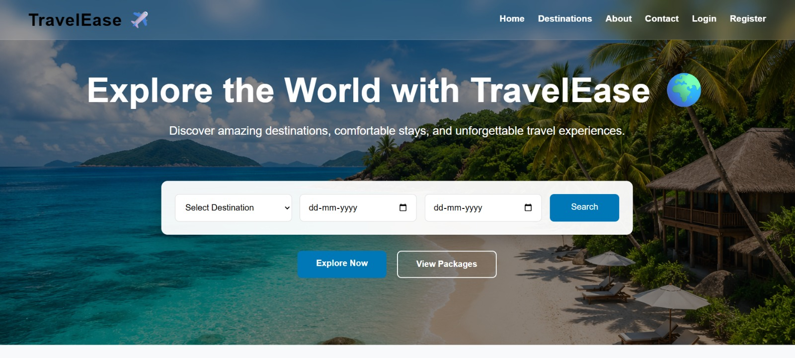
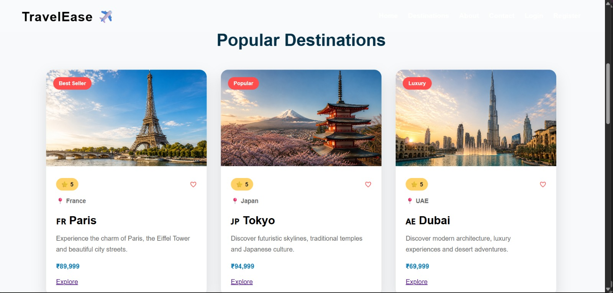
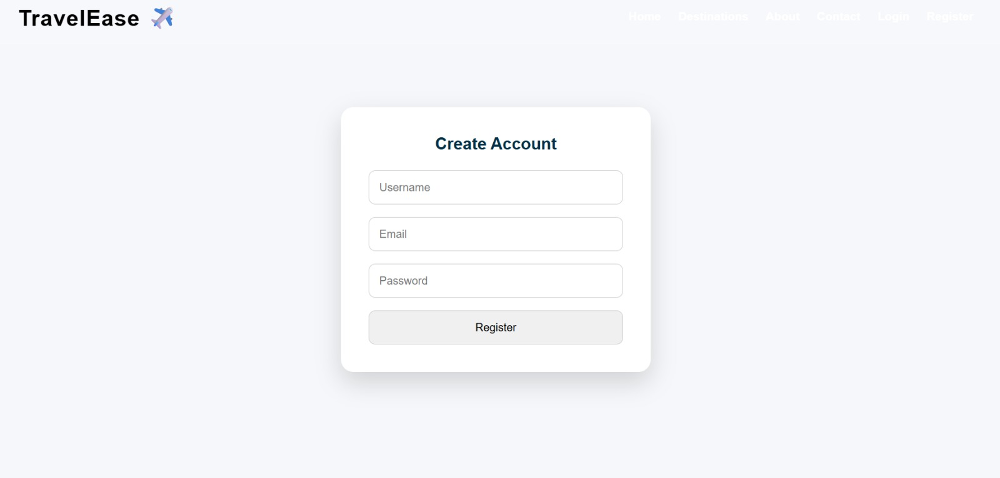
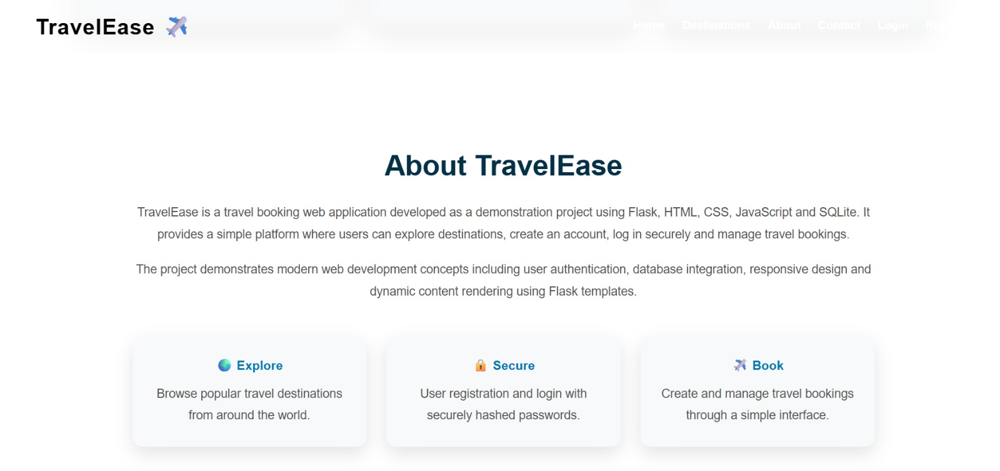
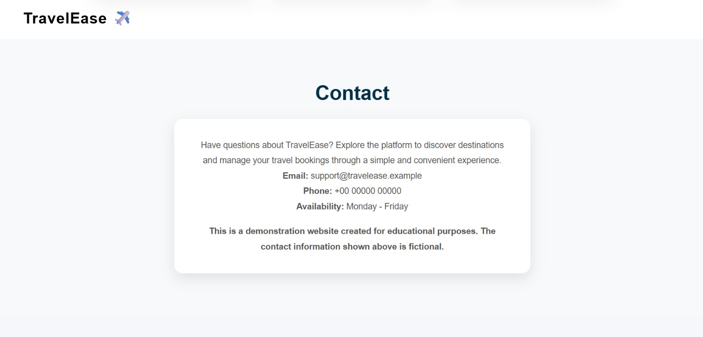

# ✈️ TravelEase

TravelEase is a full-stack travel booking web application built using Flask and SQLite. It provides a simple and user-friendly platform where users can explore destinations, create an account, log in securely, book trips, view their bookings, and cancel bookings.

> This project was created for educational and demonstration purposes.

---

## ✨ Features

- 🌍 Explore popular travel destinations
- 👤 User registration
- 🔐 Secure user login and logout
- 🔒 Password hashing for improved security
- ✈️ Create travel bookings
- 📋 View personal bookings
- ❌ Cancel existing bookings
- 💾 SQLite database integration
- 📱 Responsive web design
- 💬 Booking success and cancellation messages
- 🧭 About and Contact sections

---

## 🛠️ Technologies Used

### Backend
- Python
- Flask
- Flask-SQLAlchemy
- Flask-WTF
- WTForms
- Werkzeug

### Frontend
- HTML5
- CSS3
- JavaScript
- Jinja2 Templates

### Database
- SQLite

### Version Control
- Git
- GitHub

---

## 📁 Project Structure

```text
TravelEase/
│
├── app/
│   ├── static/
│   │   ├── css/
│   │   │   └── style.css
│   │   ├── images/
│   │   └── js/
│   │
│   ├── templates/
│   │   ├── base.html
│   │   ├── booking.html
│   │   ├── index.html
│   │   ├── login.html
│   │   ├── my_bookings.html
│   │   └── register.html
│   │
│   ├── __init__.py
│   ├── forms.py
│   ├── models.py
│   └── routes.py
│
├── .gitignore
├── config.py
├── requirements.txt
└── run.py
---

## 🚀 Installation and Setup

### 1. Clone the repository

```bash
git clone https://github.com/Deepak6788/Travel-Ease-.git
```

### 2. Open the project folder

```bash
cd Travel-Ease-
```

### 3. Create a virtual environment

```bash
python -m venv venv
```

### 4. Activate the virtual environment

```bash
venv\Scripts\activate
```

### 5. Install required packages

```bash
pip install -r requirements.txt
```

### 6. Run the application

```bash
python run.py
```

Then open the local address displayed in the terminal, usually:

```text
http://127.0.0.1:5000
```

---

## 📸 Application Screenshots

### Home Page


### Destinations


### Registration Page


### About Section


### Contact Section
